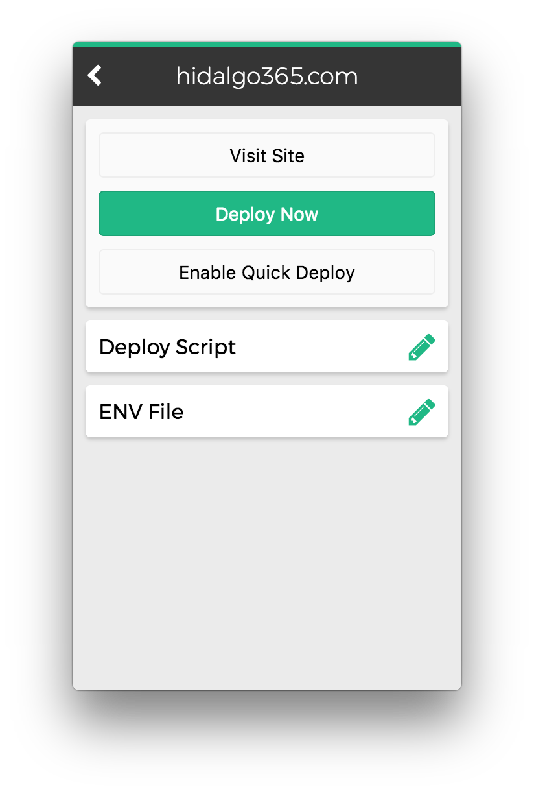

  

## A Laravel Forge Server Manager

  

## Currently Supports

- Listing Servers
- Viewing Server Sites
- Rebooting a Server
- Rebooting MySQL
- Rebooting Nginx
- Rebooting Postgres
- SSH into Server using iTerm (Native Terminal Coming soon)
- Viewing a Server on Forge Website
- Deploying Sites
- Toggle Quick Deploy
- Viewing a Site on Forge Website
- Editing Deployment Scripts
- Editing ENV Files
- View Deployment Logs

## Installation

Download the most recent version from the ["Releases"](https://github.com/phppirate/anvil/releases) page and add it to your Applications folder.

Then go and get an Api Token from Forge and add it to the app.